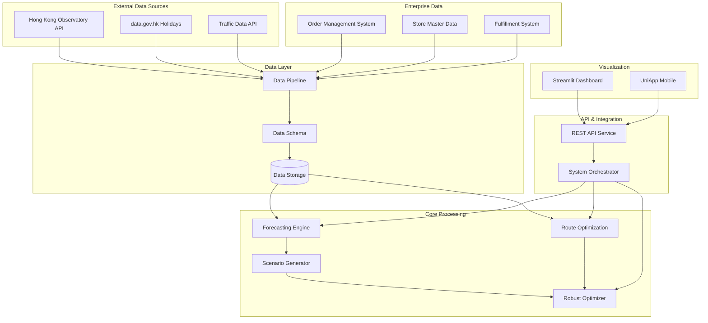
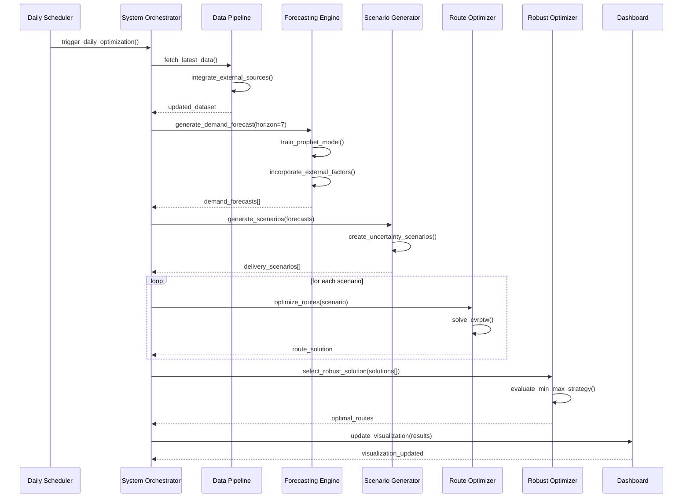
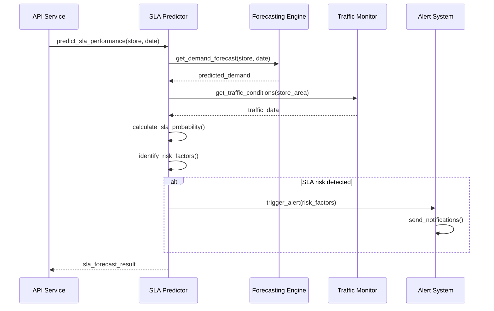

# Design Document: Logistics Optimization System

## Overview

The Logistics Optimization System is a comprehensive solution for Mannings store pickup SLA optimization that integrates real-time data sources, advanced forecasting algorithms, and robust route optimization to improve delivery performance and customer satisfaction. The system combines demand forecasting using Prophet models, multi-scenario route optimization with OR-Tools, and robust optimization strategies to handle uncertainty in delivery operations.

The system addresses three core challenges: (1) accurate demand prediction incorporating weather, holidays, and traffic patterns, (2) optimal vehicle routing under capacity and time window constraints, and (3) robust decision-making under uncertainty. By integrating external data sources (Hong Kong Observatory weather, government holidays, traffic conditions) with enterprise order and fulfillment data, the system provides end-to-end optimization from demand forecasting to route execution.

## Architecture

The system follows a modular microservices architecture with clear separation of concerns across data ingestion, processing, forecasting, optimization, and visualization layers.



## Sequence Diagrams

### Daily Optimization Workflow



### Real-time SLA Prediction


## Components and Interfaces

### Component 1: Data Pipeline

**Purpose**: Orchestrates data ingestion from multiple external and internal sources, ensuring data quality and consistency across the system.

**Interface**:
```python
class DataPipeline:
    def fetch_external_data(self, sources: List[str], date_range: Tuple[date, date]) -> Dict[str, pd.DataFrame]
    def process_enterprise_data(self, raw_data: Dict[str, pd.DataFrame]) -> Dict[str, pd.DataFrame]
    def validate_data_quality(self, data: pd.DataFrame) -> DataQualityReport
    def integrate_datasets(self, datasets: Dict[str, pd.DataFrame]) -> pd.DataFrame
    def get_processing_stats(self) -> Dict[str, Any]
```

**Responsibilities**:
- Fetch weather data from Hong Kong Observatory API with 9-day forecasts
- Retrieve public holidays from data.gov.hk with automatic updates
- Integrate traffic conditions from strategic road monitoring systems
- Process enterprise order, store, and fulfillment data with validation
- Maintain data lineage and quality metrics for monitoring

### Component 2: Forecasting Engine

**Purpose**: Provides multi-horizon demand forecasting using Prophet models with external factor integration and confidence interval estimation.

**Interface**:
```python
class ForecastingEngine:
    def train_prophet_model(self, historical_data: pd.DataFrame, external_features: Dict[str, pd.DataFrame]) -> ProphetModel
    def generate_demand_forecast(self, store_code: str, sku_id: str, horizon_days: int) -> DemandForecast
    def calculate_confidence_intervals(self, forecast: pd.DataFrame, levels: List[float]) -> Dict[str, float]
    def incorporate_weather_impact(self, base_forecast: pd.DataFrame, weather_data: List[WeatherData]) -> pd.DataFrame
    def evaluate_model_performance(self, test_data: pd.DataFrame) -> Dict[str, float]
```

**Responsibilities**:
- Train Prophet models with seasonality detection and trend analysis
- Integrate weather impact factors (temperature, rainfall, humidity effects)
- Account for holiday effects using government holiday calendar
- Generate P10/P50/P90 confidence intervals for uncertainty quantification
- Provide model performance metrics (MAPE, RMSE, directional accuracy)

### Component 3: Route Optimization Engine

**Purpose**: Solves Capacitated Vehicle Routing Problems with Time Windows (CVRPTW) using OR-Tools optimization framework.

**Interface**:
```python
class RouteOptimizationEngine:
    def solve_cvrptw(self, orders: List[OrderDetail], vehicles: List[DeliveryVehicle], constraints: Dict[str, Any]) -> RouteOptimizationResult
    def calculate_distance_matrix(self, locations: List[Tuple[float, float]]) -> np.ndarray
    def validate_solution_feasibility(self, solution: RouteOptimizationResult) -> bool
    def optimize_vehicle_assignment(self, orders: List[OrderDetail], capacity_constraints: Dict[str, int]) -> Dict[str, List[str]]
    def estimate_delivery_times(self, routes: Dict[str, List[str]], traffic_conditions: List[TrafficCondition]) -> Dict[str, float]
```

**Responsibilities**:
- Solve multi-vehicle routing with capacity and time window constraints
- Calculate optimal routes minimizing total distance and delivery time
- Handle vehicle capacity limitations and driver working hour constraints
- Integrate real-time traffic conditions for accurate time estimation
- Provide solution validation and feasibility checking

### Component 4: Scenario Generator

**Purpose**: Creates multiple delivery scenarios based on demand uncertainty and external factor variations for robust optimization.

**Interface**:
```python
class ScenarioGenerator:
    def generate_demand_scenarios(self, base_forecast: Dict[str, float], uncertainty_params: Dict[str, float]) -> List[DeliveryScenario]
    def incorporate_weather_scenarios(self, base_scenario: DeliveryScenario, weather_forecasts: List[WeatherData]) -> List[DeliveryScenario]
    def calculate_scenario_probabilities(self, scenarios: List[DeliveryScenario]) -> List[float]
    def create_traffic_impact_scenarios(self, base_routes: Dict[str, List[str]], traffic_variations: Dict[str, float]) -> List[DeliveryScenario]
    def validate_scenario_consistency(self, scenario: DeliveryScenario) -> bool
```

**Responsibilities**:
- Generate multiple demand scenarios using forecast confidence intervals
- Create weather impact scenarios (sunny, rainy, stormy conditions)
- Model traffic congestion variations and their delivery impact
- Assign realistic probabilities to each scenario based on historical patterns
- Ensure scenario consistency and business rule compliance

### Component 5: Robust Optimizer

**Purpose**: Selects optimal routing solutions that perform well across multiple uncertain scenarios using robust optimization strategies.

**Interface**:
```python
class RobustOptimizer:
    def optimize_min_max_strategy(self, scenario_solutions: List[RouteOptimizationResult]) -> RouteOptimizationResult
    def optimize_expected_value_strategy(self, scenario_solutions: List[RouteOptimizationResult], probabilities: List[float]) -> RouteOptimizationResult
    def optimize_weighted_sum_strategy(self, scenario_solutions: List[RouteOptimizationResult], weights: Dict[str, float]) -> RouteOptimizationResult
    def evaluate_solution_robustness(self, solution: RouteOptimizationResult, scenarios: List[DeliveryScenario]) -> float
    def calculate_regret_matrix(self, solutions: List[RouteOptimizationResult], scenarios: List[DeliveryScenario]) -> np.ndarray
```

**Responsibilities**:
- Implement min-max robust optimization for worst-case performance
- Provide expected value optimization for average-case performance
- Support weighted multi-objective optimization with customizable priorities
- Calculate robustness metrics and solution stability measures
- Generate regret analysis for decision support and strategy comparison

### Component 6: SLA Predictor

**Purpose**: Predicts Service Level Agreement compliance probability and identifies risk factors for proactive management.

**Interface**:
```python
class SLAPredictor:
    def predict_sla_compliance(self, store_code: str, forecast_date: date, route_plan: RouteOptimizationResult) -> SLAForecast
    def identify_risk_factors(self, store_code: str, forecast_date: date) -> Dict[str, float]
    def calculate_improvement_recommendations(self, sla_forecast: SLAForecast) -> List[str]
    def monitor_real_time_sla_performance(self, active_orders: List[OrderDetail]) -> Dict[str, float]
    def generate_sla_alerts(self, sla_forecasts: List[SLAForecast], threshold: float) -> List[AlertMessage]
```

**Responsibilities**:
- Predict SLA compliance probability using historical performance and current conditions
- Identify key risk factors (high demand, weather, traffic, capacity constraints)
- Generate actionable improvement recommendations for operations teams
- Monitor real-time SLA performance against targets
- Trigger proactive alerts when SLA risks are detected

## Data Models

### Model 1: StoreLocation

```python
@dataclass
class StoreLocation:
    store_code: str
    latitude: float
    longitude: float
    district: str
    address: str
    geocode_status: GeocodeStatus
    accuracy_note: Optional[str] = None
```

**Validation Rules**:
- Latitude must be within Hong Kong bounds (22.1 <= lat <= 22.6)
- Longitude must be within Hong Kong bounds (113.8 <= lng <= 114.5)
- Store code must be unique and non-empty
- Geocode status must indicate successful coordinate resolution

### Model 2: OrderDetail

```python
@dataclass
class OrderDetail:
    order_id: str
    user_id: str
    fulfillment_store_code: str
    order_date: date
    items: List[OrderItem]
    total_quantity: int
    unique_sku_count: int
    total_amount: Optional[float] = None
    priority: int = 1
```

**Validation Rules**:
- Order ID must be unique and follow enterprise naming convention
- Total quantity must equal sum of individual item quantities
- Unique SKU count must match length of items list
- Priority must be between 1 (normal) and 3 (urgent)

### Model 3: DemandForecast

```python
@dataclass
class DemandForecast:
    store_code: str
    sku_id: str
    forecast_date: date
    predicted_demand: float
    confidence_intervals: Dict[str, float]  # {"P10": 10, "P50": 15, "P90": 25}
    external_factors: Dict[str, float]  # {"weather_impact": 0.1, "holiday_impact": 0.3}
    model_version: str
    forecast_timestamp: datetime
```

**Validation Rules**:
- Predicted demand must be non-negative
- Confidence intervals must satisfy P10 <= P50 <= P90
- External factor impacts must be between -1.0 and 1.0
- Model version must reference a deployed forecasting model

### Model 4: RouteOptimizationResult

```python
@dataclass
class RouteOptimizationResult:
    scenario_id: str
    vehicle_routes: Dict[str, List[str]]  # vehicle_id -> [store_codes]
    total_distance: float
    total_time: float
    total_cost: float
    sla_compliance_rate: float
    optimization_timestamp: datetime
    solver_status: str
```

**Validation Rules**:
- All vehicle routes must respect capacity constraints
- Total distance and time must be positive values
- SLA compliance rate must be between 0.0 and 1.0
- Solver status must indicate successful optimization completion

### Model 5: DeliveryScenario

```python
@dataclass
class DeliveryScenario:
    scenario_id: str
    orders: List[OrderDetail]
    demand_forecast: Dict[str, float]  # store_code -> demand_multiplier
    weather_impact: float
    traffic_impact: float
    probability: float
    generated_timestamp: datetime
```

**Validation Rules**:
- Scenario probability must be between 0.0 and 1.0
- Demand multipliers must be positive values
- Weather and traffic impacts must be realistic (-0.5 to 0.5 range)
- Orders list must contain valid OrderDetail objects
## Algorithmic Pseudocode

### Main Processing Algorithm

```pascal
ALGORITHM processMainOptimizationWorkflow(target_date)
INPUT: target_date of type Date
OUTPUT: optimization_result of type RobustOptimizationResult

BEGIN
  ASSERT target_date >= current_date()
  
  // Step 1: Data Collection and Integration
  external_data ← fetchExternalData(target_date)
  enterprise_data ← fetchEnterpriseData(target_date)
  integrated_data ← integrateDataSources(external_data, enterprise_data)
  
  ASSERT validateDataQuality(integrated_data) = true
  
  // Step 2: Demand Forecasting with External Factors
  forecast_horizon ← 7  // days
  demand_forecasts ← []
  
  FOR each store IN integrated_data.stores DO
    FOR each sku IN store.active_skus DO
      ASSERT store.is_active = true
      
      base_forecast ← trainProphetModel(store, sku, integrated_data.historical_orders)
      weather_adjusted ← incorporateWeatherImpact(base_forecast, external_data.weather)
      holiday_adjusted ← incorporateHolidayImpact(weather_adjusted, external_data.holidays)
      
      final_forecast ← DemandForecast(
        store_code: store.code,
        sku_id: sku.id,
        predicted_demand: holiday_adjusted.point_forecast,
        confidence_intervals: calculateConfidenceIntervals(holiday_adjusted, [0.1, 0.5, 0.9])
      )
      
      demand_forecasts.add(final_forecast)
    END FOR
  END FOR
  
  ASSERT demand_forecasts.length > 0
  
  // Step 3: Scenario Generation with Uncertainty Modeling
  base_scenarios ← generateDemandScenarios(demand_forecasts, num_scenarios: 10)
  weather_scenarios ← incorporateWeatherUncertainty(base_scenarios, external_data.weather_forecast)
  traffic_scenarios ← incorporateTrafficVariations(weather_scenarios, external_data.traffic)
  
  final_scenarios ← []
  FOR each scenario IN traffic_scenarios DO
    scenario.probability ← calculateScenarioProbability(scenario)
    ASSERT 0.0 <= scenario.probability <= 1.0
    final_scenarios.add(scenario)
  END FOR
  
  // Step 4: Multi-Scenario Route Optimization
  route_solutions ← []
  vehicles ← getAvailableVehicles(target_date)
  
  FOR each scenario IN final_scenarios DO
    ASSERT scenario.orders.length > 0
    
    // Parallel route optimization for each scenario
    route_result ← solveCVRPTW(
      orders: scenario.orders,
      vehicles: vehicles,
      constraints: {
        max_capacity: 100,
        time_window: "06:00-18:00",
        max_route_time: 8.0
      }
    )
    
    ASSERT validateRouteFeasibility(route_result) = true
    route_solutions.add(route_result)
  END FOR
  
  // Step 5: Robust Solution Selection
  robust_result ← selectRobustSolution(route_solutions, final_scenarios, strategy: "min_max")
  
  ASSERT robust_result.selected_route != null
  ASSERT robust_result.robustness_score >= 0.0
  
  RETURN robust_result
END
```

**Preconditions:**
- target_date is a valid future date
- External data sources (HKO, data.gov.hk, traffic) are accessible
- Enterprise data systems are available and contain historical order data
- At least one active store and vehicle are available for optimization

**Postconditions:**
- Returns a valid RobustOptimizationResult with feasible routes
- All vehicle capacity and time window constraints are satisfied
- Robustness score indicates solution quality across scenarios
- Selected route minimizes worst-case performance impact

**Loop Invariants:**
- All processed stores have valid location coordinates
- All generated forecasts have non-negative demand values
- All route solutions satisfy vehicle capacity constraints
- Scenario probabilities sum to approximately 1.0

### Demand Forecasting Algorithm

```pascal
ALGORITHM trainProphetModel(store, sku, historical_data)
INPUT: store of type StoreInfo, sku of type SKUInfo, historical_data of type DataFrame
OUTPUT: forecast_model of type ProphetModel

BEGIN
  // Data preparation and validation
  time_series_data ← extractTimeSeries(historical_data, store.code, sku.id)
  ASSERT time_series_data.length >= 30  // Minimum 30 days of data
  
  // Feature engineering for external factors
  weather_features ← extractWeatherFeatures(time_series_data, historical_weather)
  holiday_features ← extractHolidayFeatures(time_series_data, holiday_calendar)
  temporal_features ← extractTemporalFeatures(time_series_data)  // day_of_week, month, etc.
  
  // Prophet model configuration
  model ← Prophet(
    yearly_seasonality: true,
    weekly_seasonality: true,
    daily_seasonality: false,
    changepoint_prior_scale: 0.05,
    seasonality_prior_scale: 10.0
  )
  
  // Add external regressors
  model.add_regressor('temperature', prior_scale: 0.5)
  model.add_regressor('rainfall', prior_scale: 0.3)
  model.add_regressor('is_holiday', prior_scale: 1.0)
  model.add_regressor('day_of_week', prior_scale: 0.8)
  
  // Model training with cross-validation
  training_data ← prepareTrainingData(time_series_data, weather_features, holiday_features, temporal_features)
  model.fit(training_data)
  
  // Model validation
  validation_metrics ← crossValidateModel(model, training_data, cv_folds: 5)
  ASSERT validation_metrics.mape < 0.20  // MAPE should be less than 20%
  
  RETURN model
END
```

**Preconditions:**
- Store and SKU are valid and active in the system
- Historical data contains at least 30 days of order history
- Weather and holiday data are available for the historical period
- Time series data has consistent daily granularity

**Postconditions:**
- Returns a trained Prophet model with validation metrics
- Model MAPE (Mean Absolute Percentage Error) is below 20%
- External regressors are properly configured and fitted
- Model can generate forecasts with confidence intervals

**Loop Invariants:**
- All training data points have valid timestamps and non-negative demand values
- External regressor values are within expected ranges
- Cross-validation folds maintain temporal ordering

### Route Optimization Algorithm

```pascal
ALGORITHM solveCVRPTW(orders, vehicles, constraints)
INPUT: orders of type List[OrderDetail], vehicles of type List[DeliveryVehicle], constraints of type Dict
OUTPUT: route_result of type RouteOptimizationResult

BEGIN
  // Problem setup and validation
  ASSERT orders.length > 0 AND vehicles.length > 0
  
  num_locations ← orders.length + 1  // +1 for depot
  num_vehicles ← vehicles.length
  
  // Distance matrix calculation
  locations ← [depot_location] + extractOrderLocations(orders)
  distance_matrix ← calculateDistanceMatrix(locations)
  time_matrix ← calculateTimeMatrix(locations, current_traffic_conditions)
  
  // OR-Tools model setup
  routing_model ← RoutingIndexManager(num_locations, num_vehicles, depot_index: 0)
  routing ← RoutingModel(routing_model)
  
  // Distance callback function
  FUNCTION distance_callback(from_index, to_index)
    from_node ← routing_model.IndexToNode(from_index)
    to_node ← routing_model.IndexToNode(to_index)
    RETURN distance_matrix[from_node][to_node]
  END FUNCTION
  
  transit_callback_index ← routing.RegisterTransitCallback(distance_callback)
  routing.SetArcCostEvaluatorOfAllVehicles(transit_callback_index)
  
  // Capacity constraints
  FOR each vehicle_id IN range(num_vehicles) DO
    vehicle ← vehicles[vehicle_id]
    demand_callback_index ← routing.RegisterUnaryTransitCallback(
      LAMBDA(from_index): orders[routing_model.IndexToNode(from_index)].total_quantity
    )
    
    routing.AddDimensionWithVehicleCapacity(
      demand_callback_index,
      slack_max: 0,
      vehicle_capacities: [vehicle.capacity],
      fix_start_cumul_to_zero: true,
      name: f"Capacity_{vehicle_id}"
    )
  END FOR
  
  // Time window constraints
  time_callback_index ← routing.RegisterTransitCallback(
    LAMBDA(from_index, to_index): time_matrix[routing_model.IndexToNode(from_index)][routing_model.IndexToNode(to_index)]
  )
  
  routing.AddDimension(
    time_callback_index,
    slack_max: 30,  // 30 minutes slack
    capacity: 480,  // 8 hours in minutes
    fix_start_cumul_to_zero: true,
    name: "Time"
  )
  
  time_dimension ← routing.GetDimensionOrDie("Time")
  
  // Set time windows for each location
  FOR each order_index IN range(1, num_locations) DO  // Skip depot
    order ← orders[order_index - 1]
    time_window_start ← parseTime(constraints.time_window_start)
    time_window_end ← parseTime(constraints.time_window_end)
    
    time_dimension.CumulVar(order_index).SetRange(time_window_start, time_window_end)
  END FOR
  
  // Solver configuration
  search_parameters ← DefaultRoutingSearchParameters()
  search_parameters.first_solution_strategy ← FirstSolutionStrategy.PATH_CHEAPEST_ARC
  search_parameters.local_search_metaheuristic ← LocalSearchMetaheuristic.GUIDED_LOCAL_SEARCH
  search_parameters.time_limit.seconds ← 30
  
  // Solve the problem
  solution ← routing.SolveWithParameters(search_parameters)
  
  IF solution != null THEN
    // Extract solution
    vehicle_routes ← {}
    total_distance ← 0
    total_time ← 0
    
    FOR each vehicle_id IN range(num_vehicles) DO
      route ← []
      route_distance ← 0
      route_time ← 0
      
      index ← routing.Start(vehicle_id)
      WHILE NOT routing.IsEnd(index) DO
        node ← routing_model.IndexToNode(index)
        IF node != 0 THEN  // Skip depot
          route.add(orders[node - 1].fulfillment_store_code)
        END IF
        
        previous_index ← index
        index ← solution.Value(routing.NextVar(index))
        route_distance ← route_distance + distance_callback(previous_index, index)
        route_time ← route_time + time_matrix[routing_model.IndexToNode(previous_index)][routing_model.IndexToNode(index)]
      END WHILE
      
      vehicle_routes[vehicles[vehicle_id].vehicle_id] ← route
      total_distance ← total_distance + route_distance
      total_time ← total_time + route_time
    END FOR
    
    // Calculate SLA compliance rate
    sla_compliance ← calculateSLACompliance(vehicle_routes, orders, constraints.sla_target_hours)
    
    route_result ← RouteOptimizationResult(
      scenario_id: generateScenarioId(),
      vehicle_routes: vehicle_routes,
      total_distance: total_distance,
      total_time: total_time,
      total_cost: calculateRouteCost(total_distance, total_time),
      sla_compliance_rate: sla_compliance,
      optimization_timestamp: current_timestamp(),
      solver_status: "OPTIMAL"
    )
    
    ASSERT validateRouteFeasibility(route_result) = true
    RETURN route_result
  ELSE
    RETURN RouteOptimizationResult(solver_status: "INFEASIBLE")
  END IF
END
```

**Preconditions:**
- Orders list contains valid OrderDetail objects with store locations
- Vehicles list contains available DeliveryVehicle objects with capacity constraints
- Distance and time matrices are symmetric and satisfy triangle inequality
- Time window constraints are feasible and non-conflicting

**Postconditions:**
- Returns feasible route solution or indicates infeasibility
- All vehicle capacity constraints are satisfied
- All time window constraints are respected
- Total distance and time are minimized subject to constraints

**Loop Invariants:**
- All processed routes respect vehicle capacity limits
- All time windows remain feasible throughout route construction
- Distance calculations are consistent and non-negative
## Key Functions with Formal Specifications

### Function 1: generateDemandForecast()

```python
def generateDemandForecast(store_code: str, sku_id: str, forecast_date: date, 
                          historical_data: pd.DataFrame, external_factors: Dict[str, Any]) -> DemandForecast
```

**Preconditions:**
- `store_code` is a valid active store identifier in the system
- `sku_id` is a valid SKU identifier available at the specified store
- `forecast_date` is a future date within the forecasting horizon (≤ 30 days)
- `historical_data` contains at least 30 days of order history for the store-SKU combination
- `external_factors` contains valid weather, holiday, and traffic data for the forecast period

**Postconditions:**
- Returns a valid DemandForecast object with non-negative predicted demand
- Confidence intervals satisfy P10 ≤ P50 ≤ P90 ordering constraint
- External factor impacts are within reasonable bounds (-1.0 ≤ impact ≤ 1.0)
- Model version references the currently deployed Prophet model
- Forecast timestamp indicates when the prediction was generated

**Loop Invariants:** N/A (no loops in this function)

### Function 2: optimizeVehicleRoutes()

```python
def optimizeVehicleRoutes(orders: List[OrderDetail], vehicles: List[DeliveryVehicle], 
                         constraints: Dict[str, Any]) -> RouteOptimizationResult
```

**Preconditions:**
- `orders` is a non-empty list of valid OrderDetail objects
- `vehicles` is a non-empty list of available DeliveryVehicle objects
- All orders have valid store locations within Hong Kong geographic bounds
- Vehicle capacities are positive integers greater than maximum single order quantity
- Time window constraints are feasible and allow sufficient travel time

**Postconditions:**
- Returns a feasible RouteOptimizationResult or indicates infeasibility
- All vehicle capacity constraints are satisfied (∑order_quantities ≤ vehicle_capacity)
- All time window constraints are respected for each delivery location
- Total route distance and time are minimized subject to constraints
- SLA compliance rate is calculated based on target delivery times

**Loop Invariants:**
- For route construction loops: All partially constructed routes remain feasible
- For vehicle assignment loops: Total assigned capacity never exceeds vehicle limits
- For time window validation loops: All scheduled deliveries remain within allowed windows

### Function 3: selectRobustSolution()

```python
def selectRobustSolution(scenario_solutions: List[RouteOptimizationResult], 
                        scenarios: List[DeliveryScenario], strategy: str) -> RobustOptimizationResult
```

**Preconditions:**
- `scenario_solutions` contains feasible route solutions for each scenario
- `scenarios` contains valid DeliveryScenario objects with probabilities summing to ≈ 1.0
- `strategy` is one of ["min_max", "expected_value", "weighted_sum"]
- Number of solutions matches number of scenarios
- All solutions have valid cost and performance metrics

**Postconditions:**
- Returns the optimal solution according to the specified robust optimization strategy
- Selected solution is feasible across all considered scenarios
- Robustness score indicates solution stability (0.0 ≤ score ≤ 1.0)
- Confidence level reflects the probability of achieving target performance
- Solution minimizes worst-case regret or maximizes expected performance

**Loop Invariants:**
- For solution evaluation loops: All candidate solutions remain feasible
- For regret calculation loops: Regret values are non-negative
- For strategy comparison loops: Performance metrics are consistently calculated

### Function 4: predictSLACompliance()

```python
def predictSLACompliance(store_code: str, forecast_date: date, 
                        route_plan: RouteOptimizationResult) -> SLAForecast
```

**Preconditions:**
- `store_code` is a valid active store with historical SLA performance data
- `forecast_date` is within the operational planning horizon
- `route_plan` is a feasible route optimization result
- Historical SLA data is available for model training and calibration
- Current traffic and weather conditions are accessible for impact assessment

**Postconditions:**
- Returns SLA compliance probability between 0.0 and 1.0
- Confidence interval provides uncertainty bounds around the prediction
- Risk factors are identified and quantified with impact scores
- Improvement recommendations are actionable and specific to identified risks
- Prediction accuracy is validated against historical performance patterns

**Loop Invariants:** N/A (no loops in this function)

## Example Usage

```python
# Example 1: Daily Optimization Workflow
from src.core.system_orchestrator import SystemOrchestrator
from datetime import date, timedelta

orchestrator = SystemOrchestrator()
target_date = date.today() + timedelta(days=1)

# Run complete optimization pipeline
result = orchestrator.run_optimization_pipeline(target_date)

# Access optimized routes
for vehicle_id, route in result.selected_route.vehicle_routes.items():
    print(f"Vehicle {vehicle_id}: {' -> '.join(route)}")
    
# Check SLA compliance
print(f"Expected SLA compliance: {result.selected_route.sla_compliance_rate:.2%}")

# Example 2: Demand Forecasting with External Factors
from src.modules.forecasting.prophet_forecaster import ProphetForecaster
from src.modules.data.hko_fetcher import HKOWeatherFetcher

forecaster = ProphetForecaster()
weather_fetcher = HKOWeatherFetcher()

# Get weather forecast for external factors
weather_data = weather_fetcher.fetch_weather_forecast(days=7)

# Generate demand forecast
forecast = forecaster.predict_store_demand(
    store_code="417",
    sku_id="SKU001", 
    forecast_date=target_date
)

print(f"Predicted demand: {forecast.predicted_demand:.1f}")
print(f"Confidence intervals: P10={forecast.confidence_intervals['P10']:.1f}, "
      f"P50={forecast.confidence_intervals['P50']:.1f}, "
      f"P90={forecast.confidence_intervals['P90']:.1f}")

# Example 3: Route Optimization with Constraints
from src.modules.routing.ortools_optimizer import ORToolsOptimizer
from src.core.data_schema import OrderDetail, DeliveryVehicle

optimizer = ORToolsOptimizer()

# Define orders and vehicles
orders = [
    OrderDetail(order_id="ORD001", fulfillment_store_code="417", total_quantity=5),
    OrderDetail(order_id="ORD002", fulfillment_store_code="418", total_quantity=3),
    OrderDetail(order_id="ORD003", fulfillment_store_code="419", total_quantity=7)
]

vehicles = [
    DeliveryVehicle(vehicle_id="VEH001", capacity=20, current_location=(22.3, 114.2)),
    DeliveryVehicle(vehicle_id="VEH002", capacity=15, current_location=(22.3, 114.2))
]

constraints = {
    "max_route_time_hours": 8.0,
    "time_window_start": "06:00",
    "time_window_end": "18:00"
}

# Optimize routes
route_result = optimizer.optimize(orders, vehicles, constraints)

if route_result.solver_status == "OPTIMAL":
    print(f"Total distance: {route_result.total_distance:.1f} km")
    print(f"Total time: {route_result.total_time:.1f} hours")
    print(f"SLA compliance: {route_result.sla_compliance_rate:.2%}")

# Example 4: Robust Optimization Across Scenarios
from src.modules.routing.scenario_generator import ScenarioGenerator
from src.modules.routing.robust_optimizer import RobustOptimizer

scenario_gen = ScenarioGenerator()
robust_opt = RobustOptimizer()

# Generate multiple scenarios
base_demand = {"417": 1.0, "418": 1.2, "419": 0.8}
scenarios = scenario_gen.generate_scenarios(base_demand, num_scenarios=10)

# Optimize each scenario
scenario_solutions = []
for scenario in scenarios:
    solution = optimizer.optimize(scenario.orders, vehicles, constraints)
    scenario_solutions.append(solution)

# Select robust solution
robust_result = robust_opt.optimize_robust(scenarios, strategy="min_max")

print(f"Robust solution selected with robustness score: {robust_result.robustness_score:.3f}")
print(f"Worst-case SLA compliance: {min(sol.sla_compliance_rate for sol in scenario_solutions):.2%}")

# Example 5: SLA Prediction and Risk Assessment
from src.modules.forecasting.sla_predictor import SLAPredictor

sla_predictor = SLAPredictor()

# Predict SLA performance
sla_forecast = sla_predictor.predict_sla_performance("417", target_date)

print(f"Predicted SLA rate: {sla_forecast.predicted_sla_rate:.2%}")
print(f"Confidence interval: [{sla_forecast.confidence_interval[0]:.2%}, "
      f"{sla_forecast.confidence_interval[1]:.2%}]")

# Identify risk factors
risk_factors = sla_predictor.identify_risk_factors("417", target_date)
for factor, impact in risk_factors.items():
    print(f"Risk factor '{factor}': {impact:.3f} impact")

# Get improvement recommendations
recommendations = sla_forecast.improvement_recommendations
for i, rec in enumerate(recommendations, 1):
    print(f"{i}. {rec}")
```
## Correctness Properties

*A property is a characteristic or behavior that should hold true across all valid executions of a system-essentially, a formal statement about what the system should do. Properties serve as the bridge between human-readable specifications and machine-verifiable correctness guarantees.*

### Property 1: External Data Integration

*For any* external data source request (weather, holidays, traffic), the Data_Pipeline should successfully fetch, validate, and integrate the data with appropriate fallback mechanisms when sources are unavailable.

**Validates: Requirements 1.1, 1.2, 1.3, 1.4, 1.5**

### Property 2: Demand Forecast Consistency

*For any* store, SKU, and forecast date, generated demand forecasts should have non-negative predicted values with properly ordered confidence intervals (P10 ≤ P50 ≤ P90) and external factor impacts within reasonable bounds.

**Validates: Requirements 2.1, 2.2, 2.3, 2.4, 7.3**

### Property 3: Route Optimization Feasibility

*For any* set of orders, vehicles, and constraints, when the Route_Optimizer produces an optimal solution, all vehicle capacity constraints and time windows should be respected, and SLA compliance rates should be within valid probability bounds.

**Validates: Requirements 3.1, 3.2, 3.3, 3.4, 3.5, 7.4**

### Property 4: Scenario Generation Consistency

*For any* base demand forecast, generated delivery scenarios should have probabilities that sum to approximately 1.0, with individual scenario probabilities within valid bounds and realistic variations based on weather and traffic conditions.

**Validates: Requirements 4.1, 4.2, 4.3, 4.4**

### Property 5: Robust Optimization Strategy

*For any* set of scenario solutions and optimization strategy, the Robust_Optimizer should select solutions that perform optimally according to the specified strategy (min-max, expected value, or weighted sum) with valid robustness scores.

**Validates: Requirements 4.5**

### Property 6: SLA Prediction Bounds

*For any* store and forecast date, SLA compliance predictions should be within valid probability bounds (0.0-1.0) with properly ordered confidence intervals and non-negative risk factor values.

**Validates: Requirements 5.1, 5.2, 5.3, 5.4, 5.5**

### Property 7: Dashboard Data Integrity

*For any* dashboard display request, all key performance indicators, forecasts, routes, and alerts should be accurately calculated and properly formatted for visualization.

**Validates: Requirements 6.1, 6.2, 6.3, 6.4**

### Property 8: Data Validation Compliance

*For any* input data (store locations, orders, forecasts), the System should validate that coordinates are within Hong Kong bounds, identifiers are non-empty, quantities are positive, and all constraints are satisfied.

**Validates: Requirements 7.1, 7.2, 7.3, 7.4, 7.5**

### Property 9: Security and Access Control

*For any* data storage, API access, or user interaction, the System should maintain encryption, secure connections, role-based access control, data anonymization, and input validation to prevent security vulnerabilities.

**Validates: Requirements 9.1, 9.2, 9.3, 9.4, 9.5**

### Property 10: Error Recovery and Resilience

*For any* system failure scenario (external data unavailable, optimization infeasible, model training failure, performance degradation), the System should implement appropriate fallback mechanisms and recovery strategies.

**Validates: Requirements 10.1, 10.2, 10.3, 10.4, 10.5**

### Property 11: Caching and Performance Optimization

*For any* frequently accessed data (distance matrices, forecasts), the System should implement caching mechanisms that improve response times while maintaining data consistency and accuracy.

**Validates: Requirements 8.5**
```

## Error Handling

### Error Scenario 1: External Data Source Unavailable

**Condition**: Weather API (HKO) or government holiday API becomes unavailable during data fetching
**Response**: System falls back to cached historical data and generates warnings
**Recovery**: Retry mechanism with exponential backoff, alert operations team if outage exceeds 1 hour

### Error Scenario 2: Route Optimization Infeasible

**Condition**: OR-Tools solver cannot find feasible solution due to conflicting constraints
**Response**: Relax time window constraints incrementally and retry optimization
**Recovery**: If still infeasible, split orders across multiple time periods or add additional vehicles

### Error Scenario 3: Demand Forecast Model Failure

**Condition**: Prophet model training fails due to insufficient data or numerical instability
**Response**: Fall back to simple moving average with seasonal adjustment
**Recovery**: Retrain model with extended historical period or alternative preprocessing

### Error Scenario 4: SLA Prediction Accuracy Degradation

**Condition**: SLA prediction accuracy drops below 80% threshold over validation period
**Response**: Trigger model retraining with recent data and updated feature engineering
**Recovery**: Implement ensemble approach combining multiple prediction models

### Error Scenario 5: System Performance Degradation

**Condition**: Optimization pipeline execution time exceeds 5-minute threshold
**Response**: Enable parallel processing for scenario generation and route optimization
**Recovery**: Implement caching for frequently accessed data and pre-computed distance matrices

## Testing Strategy

### Unit Testing Approach

Each component will have comprehensive unit tests covering:
- **Data Pipeline**: Test data fetching, validation, and integration with mock external APIs
- **Forecasting Engine**: Validate Prophet model training, prediction accuracy, and confidence intervals
- **Route Optimizer**: Test CVRPTW solver with various constraint combinations and edge cases
- **Scenario Generator**: Verify scenario generation logic and probability calculations
- **Robust Optimizer**: Test different optimization strategies and solution selection criteria

**Coverage Goals**: Minimum 90% code coverage with focus on critical path testing

### Property-Based Testing Approach

**Property Test Library**: Hypothesis (Python)

**Key Properties to Test**:
1. **Forecast Monotonicity**: Higher confidence levels should never have lower bounds
2. **Route Capacity Constraints**: Generated routes must never exceed vehicle capacities
3. **Scenario Probability Conservation**: Generated scenario probabilities must sum to approximately 1.0
4. **Optimization Improvement**: Robust solutions should perform better than random selection
5. **Data Validation**: All input data should satisfy schema constraints

**Test Data Generation**:
- Generate random but realistic order patterns with seasonal variations
- Create diverse store location distributions across Hong Kong districts
- Simulate various weather conditions and traffic scenarios
- Test with different vehicle fleet configurations and capacity constraints

### Integration Testing Approach

**End-to-End Pipeline Testing**:
- Test complete workflow from data ingestion to route optimization
- Validate data flow between components using realistic data volumes
- Test system behavior under various external data availability scenarios
- Verify dashboard updates reflect optimization results correctly

**Performance Testing**:
- Load testing with 1000+ orders and 50+ stores
- Stress testing with extreme weather and traffic conditions
- Scalability testing with increasing number of scenarios and vehicles

## Performance Considerations

**Optimization Response Time**: Target sub-5-minute execution for daily optimization pipeline
**Forecast Generation**: Target sub-30-second response for individual store-SKU forecasts
**Route Calculation**: Target sub-2-minute optimization for 100+ orders across 10 vehicles
**Memory Usage**: Maintain peak memory usage below 4GB for standard optimization workloads
**Concurrent Users**: Support up to 10 concurrent dashboard users without performance degradation

**Optimization Strategies**:
- Implement caching for distance matrices and frequently accessed forecasts
- Use parallel processing for independent scenario optimizations
- Pre-compute seasonal patterns and holiday effects for faster forecast generation
- Implement incremental updates for route optimization when only minor changes occur

## Security Considerations

**Data Protection**: All enterprise order and customer data encrypted at rest and in transit
**API Security**: External API calls use secure HTTPS connections with API key authentication
**Access Control**: Role-based access control for dashboard and API endpoints
**Data Anonymization**: Customer identifiers anonymized in logs and analytics
**Audit Logging**: Comprehensive logging of all optimization decisions and data access

**Threat Mitigation**:
- Input validation to prevent injection attacks on API endpoints
- Rate limiting on external API calls to prevent abuse
- Secure storage of API keys and database credentials using environment variables
- Regular security updates for all dependencies and frameworks

## Dependencies

**Core Dependencies**:
- **Prophet**: Facebook's time series forecasting library for demand prediction
- **OR-Tools**: Google's optimization library for vehicle routing problems
- **Pandas**: Data manipulation and analysis for data pipeline operations
- **NumPy**: Numerical computing for mathematical operations and matrix calculations
- **Streamlit**: Web application framework for dashboard development
- **Requests**: HTTP library for external API integration

**External Services**:
- **Hong Kong Observatory API**: Weather data and forecasts
- **data.gov.hk**: Public holiday calendar and government data
- **Traffic Data API**: Real-time traffic conditions and strategic road information

**Development Dependencies**:
- **Pytest**: Testing framework for unit and integration tests
- **Hypothesis**: Property-based testing library
- **Black**: Code formatting and style consistency
- **MyPy**: Static type checking for Python code
- **Docker**: Containerization for deployment and development environments