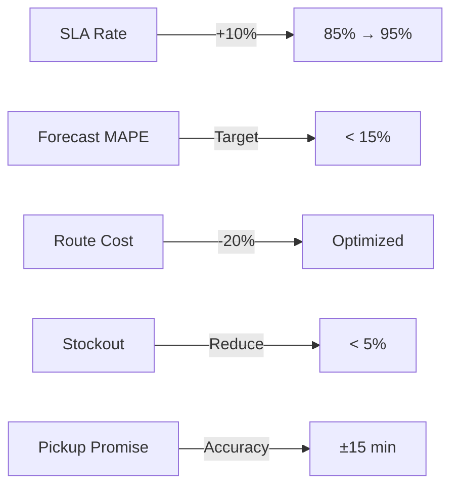
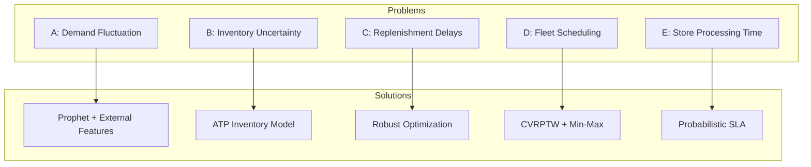
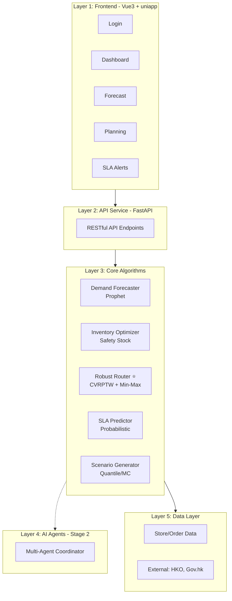
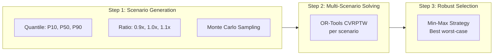
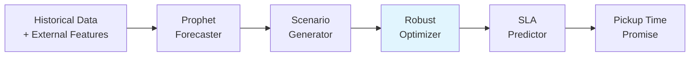
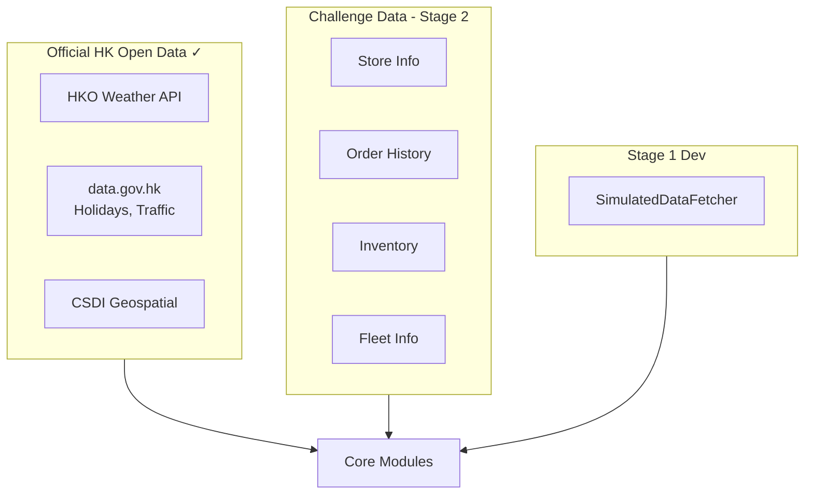
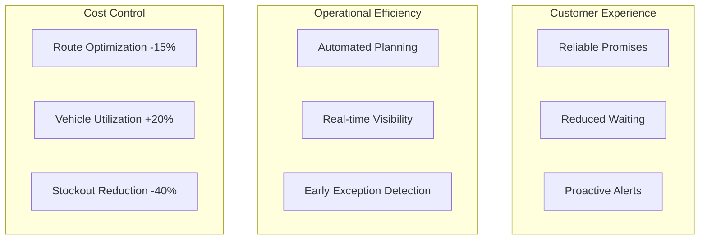
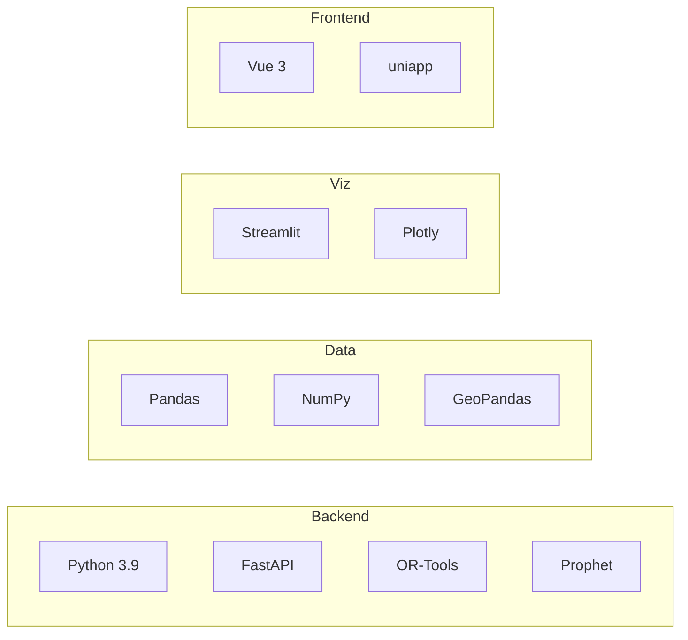
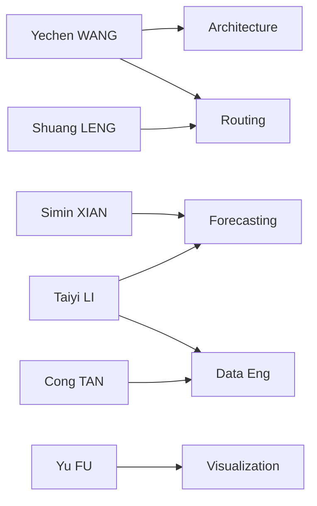

# IOT Hackathon 2026 - Mannings Store Pickup SLA Optimization
# Stage 1 Initial Proposal

<p align="center">
  <strong>Store Pickup SLA Optimization System</strong><br>
  DFI Retail Group - Mannings
</p>

**Team Name:** ESGenius  
**Submission Date:** February 15, 2026  
**Challenge:** DFI Retail Group - Mannings Store Pickup SLA Optimization

---

## 1. Objectives

### 1.1 Project Vision

Build an **end-to-end Store Pickup SLA Optimization System** for Mannings, integrating AI/ML prediction with mathematical optimization:

> **"Ensure every customer picks up their order within the promised time, while maximizing efficiency and minimizing costs"**

### 1.2 Core KPIs



### 1.3 Strategic Goals

1. **Customer Experience**: Reliable "Ready for Pickup" time promises
2. **Operations Intelligence**: Data-driven automated decisions
3. **Cost Optimization**: Minimize fleet & inventory costs while maintaining SLA
4. **Scalability**: Modular architecture for future AI Agent expansion

---

## 2. Pain Points / Problems to Address

Based on **A-E five core problems** from the Mannings Challenge Briefing:



### Problem Details

| Problem | Key Challenge | Our Solution |
|---------|---------------|--------------|
| **A. Demand** | Promotions, long-tail SKUs, seasonality | Prophet + HKO weather + promotion calendar |
| **B. Inventory** | Book ≠ Actual, multi-channel competition | Available-to-Promise model with safety stock |
| **C. Replenishment** | DC→ECDC lead time uncertainty | Scenario-based robust planning |
| **D. Routing** | Time windows, capacity, SLA vs cost | **Robust CVRPTW (Core Innovation)** |
| **E. Processing** | Picking/packing time variance | Probabilistic prediction with CI |

---

## 3. Proposed Solution

### 3.1 Five-Layer System Architecture



### 3.2 Core Innovation: Robust Routing Optimizer ⭐

Traditional routing optimization ignores demand uncertainty. Our **Scenario-based Robust CVRPTW** addresses this:



**Key Innovation Points:**
- **Uncertainty Quantification**: Convert forecast CI to demand scenarios
- **Min-Max Robustness**: Optimize for worst-case scenario performance
- **Forecast→Decision Loop**: Prediction uncertainty directly drives routing

### 3.3 End-to-End Data Flow



### 3.4 Algorithm Implementation

```python
# Robust Optimization Core Logic
from scenario_generator import ScenarioGenerator
from robust_optimizer import RobustOptimizer

# Generate demand scenarios from forecast confidence intervals
scenarios = ScenarioGenerator(
    quantile_keys={"low": "p10", "mid": "p50", "high": "p90"},
    monte_carlo_samples=5
).generate(forecast_data)

# Solve all scenarios and select robust solution
optimizer = RobustOptimizer(demand_ratios=[0.9, 1.0, 1.1])
solutions = optimizer.solve_all_scenarios(scenarios)
robust_plan = optimizer.select_robust_solution(criterion="min_max_distance")
```

**Standardized Output Format:**
```
OptimizationResult:
  - routes: [[store_ids], ...]
  - total_distance: km
  - total_time: min
  - vehicles_used: int
  - sla_risk_score: 0-1
```

---

## 4. Data Sources

### 4.1 Data Integration Architecture



### 4.2 Official Data Usage

- **HKO**: Weather forecasts → Demand adjustment factors
- **data.gov.hk**: Public holidays, traffic flow → Time estimation
- **CSDI**: Road network, geolocation → Distance matrix

---

## 5. Benefits & Impacts

### 5.1 Expected Improvements



### 5.2 Quantified Benefits

| Metric | Improvement | Impact |
|--------|-------------|--------|
| SLA Achievement | +10% (85%→95%) | Customer satisfaction ↑ |
| Delivery Distance | -15% | Fuel cost savings |
| Vehicle Utilization | +20% | Fleet size reduction |
| Stockout Rate | -40% | Lost sales reduction |
| Planning Time | -80% | Hours → Minutes |

---

## 6. Technical Stack & Repository

### 6.1 Technology Overview



### 6.2 Repository Structure

```
iot_hackathon_2026_mannings/
├── src/
│   ├── api/routers/          # FastAPI endpoints
│   ├── modules/
│   │   ├── routing/          # ⭐ Robust Optimizer
│   │   ├── forecasting/      # Prophet
│   │   ├── inventory/        # Safety Stock
│   │   └── sla/              # Probabilistic
│   └── agents/               # Stage 2 interfaces
├── config/
└── tests/
```

### 6.3 API Endpoints

| Module | Endpoint | Function |
|--------|----------|----------|
| Auth | `/api/auth/*` | Login, Token |
| Dashboard | `/api/dashboard/*` | KPI, Trends |
| Forecast | `/api/forecast/*` | Demand, Inventory |
| Planning | `/api/planning/*` | Routes, Replenishment |
| SLA | `/api/sla/*` | Orders, Alerts |

---

## Declaration

- This proposal is an **original work** by our team
- Uses official public data sources: **HKO, data.gov.hk, CSDI**
- All team members participate only in this team

**GitHub:** https://github.com/iot-hackathon-2026-teamESGenius/iot_hackathon_2026_mannings

---

# Appendix: Team Profile (Not counted in page limit)

## Team: ESGenius (6 members)

| Name | Major | Role | Responsibilities |
|------|-------|------|------------------|
| Yechen WANG | CS | Lead / Architect | Architecture, routing algorithm, proposal |
| Shuang LENG | CS | Routing Dev | CVRPTW, robust optimizer, OR-Tools |
| Simin XIAN | CS | Forecasting Dev | Prophet, inventory optimization |
| Taiyi LI | DS | Data Engineer | Official data, forecasting support |
| Cong TAN | DS | Data Engineer | Data integration, simulation |
| Yu FU | CS | Visualization | Streamlit dashboard, demo |

## Responsibility Matrix



## Timeline

- **Stage 1** (Feb 1-15): Proposal, architecture, prototypes
- **Stage 2** (Feb 16 - Mid Mar): Data integration, refinement
- **Final** (Late Mar): Testing, demo, submission
